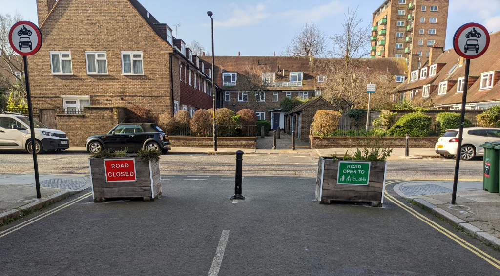
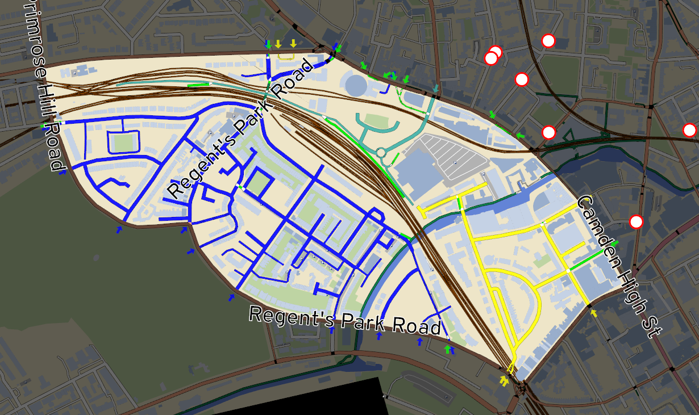
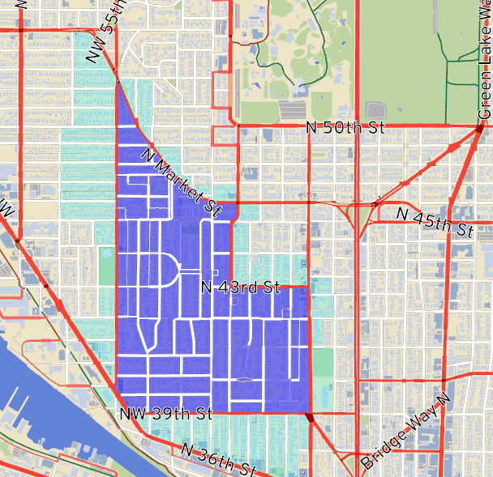
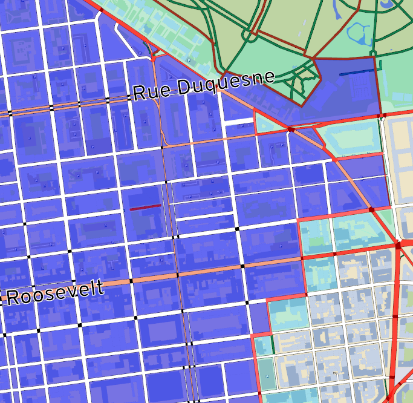
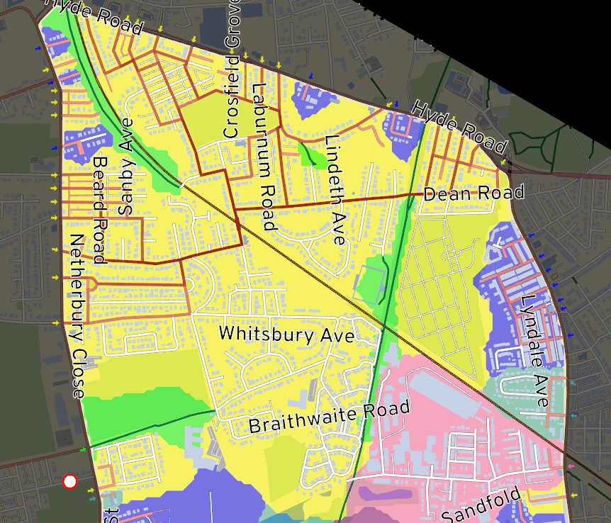

# Outline

<!-- Easier URL to find slides -->

1. Background of LTNs
2. The tool
3. Technical overview
4. Next steps

# Part 1: Background

## The problem

- Car-centric cities
  - Greenhouse gases
  - Noise pollution
  - Air quality
  - Space for parking
  - Collisions
  - Suburban sprawl and unsustainable land use
  - Lack of exercise

## The problem

:::: {.columns}
::: {.column width="50%"}

:::
::: {.column width="50%"}
Rise of traffic on local streets from sat-nav
:::
::::
*<https://assets.publishing.service.gov.uk/government/uploads/system/uploads/attachment_data/file/916749/road-traffic-estimates-in-great-britain-2019.pdf>*

## The response

Modal filters

## The response

Area of effect = Low traffic neighborhoods (LTNs)

## The response

- 2020 active travel fund
- Mixed public response
  - miscommunication
  - lack of public education
  - hasty consultations
  - genuinely poorly designed LTNs

## The current planning process

Communication by diagram

## The current planning process

- Live workshops
- *<https://www.youtube.com/watch?v=pHucS2F33W8&t=1052s>*

## The current planning process

- How's this affect my trips?

# Part 2: The LTN tool

## Demo

## The LTN tool

- *<http://ltn.abstreet.org>*
- web browser, Mac, Windows, Linux
  - no mobile
- free, open source
- multiple audiences
  - local authorities / consultants
  - individuals
  - campaign groups

## Scope

- works anywhere, thanks to OpenStreetMap
  - most appropriate for cities

## Credits

- Dustin Carlino: project lead
- Cindy Huang: UX designer (beginning of March)
- Thanks
  - Robin Lovelace: product manager
  - Brian Deegan, Will Petty, Sustrans
  - Martin Lucas-Smith (CycleStreets)
  - Feedback and testing from many!

## Credits

- built on the A/B Street platform
- alumni: Michael Kirk and Yuwen Li

# Part 3: Technical overview

A teaser; join the workshop at 15:00 tomorrow!

- Neighborhood connectivity
- Predicting rat-runs
- Defining a neighborhood
- Assessing overall impact
- Heuristics for placing filters

## A neighborhood

:::: {.columns}
::: {.column width="50%"}

:::
::: {.column width="50%"}
- the perimeter
  - usually "major" roads designed to handle more traffic
- the interior
  - reduce traffic through here
:::
::::

## Cells

Everywhere reachable by driving within the neighborhood, without leaving

## Cells

## Disconnected cells

- A cell must touch the perimeter somewhere!
  - Otherwise, drivers can't get in / out

## Calculating cells

- Graph floodfill
- Visualize as areas by diffusion of colored tiles on a grid
- 4-color theorem and Marching Squares algorithm

## Predicting rat-runs

- What's a rat-run?
- Why are some streets quiet?

## Predicting rat-runs

## Rat-run definition

- A shortest path starting and ending on the perimeter road
  - But not the same start/end road
  - Path restricted to the neighborhood
- **Not** the bigger picture
  - Does this path save somebody time?
  - How many people might take this shortcut?

## Rat-run results

## Rat-run results

## Rat-run results

## Defining a neighborhood

## Defining a neighborhood

- This process will cross railroads, water
  - If it didn't, we're fine with heavy traffic on the nearest local road

## Boundary adjustment

- Plenty of reasons the heuristics aren't perfect
- Road classification varies regionally
- Should that high street also be a through-route?

## Boundary adjustment

Don't be too prescriptive; let users adjust

## Boundary adjustment

## Boundary adjustment

- Per block
- Partitioning into contiguous neighborhoods
- Adding a block to one neighborhood removes it from another

## Blockfinding limitations

You can't always draw the boundaries you want

## Heuristics for placing filters

- Human judgment
  - Prioritize near parks, areas with prior problems
  - Can the bin collection truck turn around?
- The use of automation
  - Seed ideas
  - Choice overload

## Where should the filter go?

## Where should the filter go?

- Greedy: the road with the most rat-runs
- Whack-a-mole

## Where should the filter go?

:::: {.columns}
::: {.column width="50%"}

:::
::: {.column width="50%"}
- Only one entrance per cell
  - Expensive, likely unpopular
  - Very different results for residents
  - Simpler crossings along the perimeter
:::
::::

## Heuristics for placing filters

Split large cells (intuition)

## Heuristics for placing filters

Minimum cut of the graph

# Part 4: Next steps

- polish, continue testing with local authorities
- share proposals online
- training material (user guide, video tutorials)
- popular feature requests
  - bus gates
  - one-way streets
  - demographics -- who lives near interventions?
  - mode shift / traffic dissipation

## Current usage

- Nottingham
- Campaigning group in Lyon
- Initial testing in ~10 other places

## Engagement model

- <dcarlino@turing.ac.uk>
- I can help import your city
- Do you have travel demand data?
- What else should this tool do?
- I'm looking for help from software engineers & UX designers

## LTNs are just the start

- interventions on perimeter roads
  - safe crossings
  - bus/cycle lanes
  - traffic signal timing

## LTNs are just the start

- other parts of A/B Street can help
  - road space reallocation
  - 15-minute neighborhoods / land use patterns
  - traffic simulation (rapid prototyping)

## Where's the AI?

- Classic computer science graph algorithms vs machine learning
- You can't argue with the results *(barring data quality / bugs)*
  -  The rat-runs show specific shortcuts!
  -  The cells show if it's possible to cut through or not!
- Explainable systems are perceived as more trustworthy

## Engaging communities

- This tool is meant for **everyone**
- People are visual, understand maps
- Build consensus in live workshops

## Conclusion

- *<http://ltn.abstreet.org>*
  - Code at *<https://github.com/a-b-street/abstreet>*
- <dcarlino@turing.ac.uk>
- Contact me to import a city, schedule training, discuss ideas
