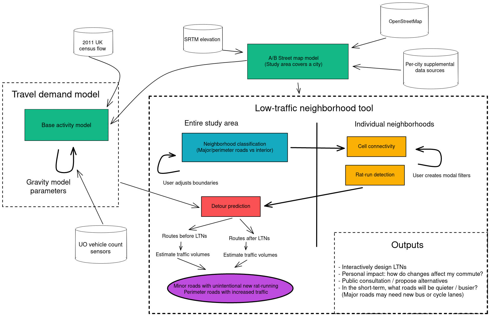

# Outline

These slides: ...

- Background of LTNs
- Demo
- Technical overview
- Next steps

# Part 1: Background

In response to rising levels of motor vehicles using sat-nav to cut through residential streets and avoid traffic, local authorities across the UK have been creating low traffic neighborhoods (LTNs). Modal filters (planters or bollards in the middle of the street) prevent drivers from passing through, but allow pedestrians and cyclists. When filters are strategically placed to prevent all through-traffic, people in the area are likely to enjoy better air quality, less noise pollution, and higher levels of physical activity.

The 2020 active travel fund jump-started many new LTN schemes, but there has been a mixed public response, stemming partly from miscommunication, lack of education, and hastened consultations. To design and share LTN schemes, planners at local authorities currently use manual workflows in existing GIS software -- or sometimes just sketching ideas over satellite imagery. The resulting schemes rely on humans to assess all possible routes for through-traffic; sharing the plans with the public is usually done with a low-resolution diagram; and members of the public have no easy way to propose an alternate design.

# Part 2: Demo

- <http://ltn.abstreet.org>
- web browser, Mac, Windows, Linux (no mobile)
- free, open source
  - <https://github.com/a-b-street/abstreet/tree/master/apps/ltn>
- targets local authority planners, individual residents, and campaign groups

## Credits

- developed in a few months
- built on top of the A/B Street platform
  - alumni: Michael Kirk, Yuwen Li

## Scope

- works anywhere, thanks to OpenStreetMap
- most appropriate for cities
- tuned for the UK

## Demo

# Part 3: Technical overview

Join the workshop tomorrow at 15:00 for details

## A neighborhood's cells

## Predicting rat-runs

## Boundary adjustment

- The importance of this conversation
- Caveats

## Predicting overall impact

## Heuristics for placing filters

# Part 4: Next steps

- mode shift
- sharing proposals online
- further engagement with LAs
- bus gates, one-way interventions
- census

## LTNs are just the start

- interventions on boundary roads
  - crossings
  - bus/cycle lanes
  - traffic signal timing
- other parts of A/B Street can help

## Conclusion

- <http://ltn.abstreet.org>
- <dcarlino@turing.ac.uk>
- <https://github.com/a-b-street/abstreet>
- Contact me to import a city, to schedule training, to discuss ideas
