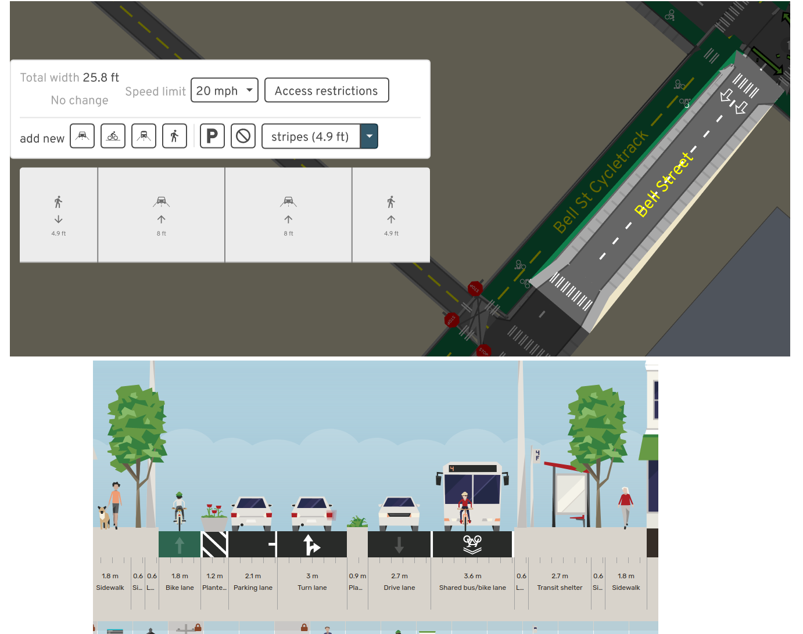
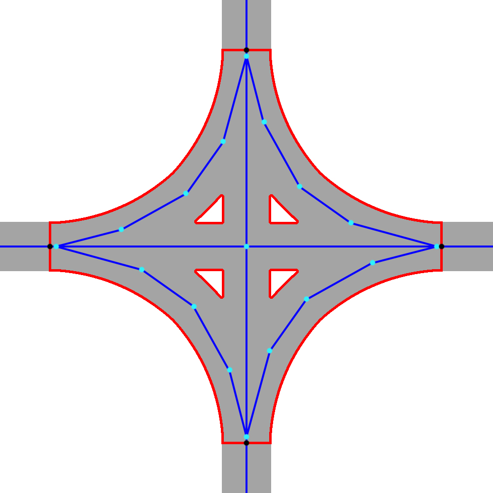

# Talk outline

- OpenStreetMap primer
- Problems
- Possible solutions
- Next steps and API design

<!-- OpenStreetMap is a widely used data source for street networks worldwide. Due to its data model, representing complex streets and junctions (often involving dual carriageways and parallel cycle tracks and footpaths) is challenging and inconsistent. As a result, many applications struggle to render, provide simple routing directions, reason about road space allocation to different modes of travel, and apply urban morphology analyses. osm2streets is an early-stage effort to transform the raw data into a simpler representation of streets and help many of these applications. This talk will motivate the project and discuss early results. -->

# OpenStreetMap primer

<https://www.openstreetmap.org/#map=18/52.45115/-1.93205>

## OSM primer

## OSM representation of streets

- **Node**: Points with key/value strings
- **Way**: Line-string with key/value strings

## OSM representation of streets

- The way's attributes describe the lanes, direction, speed limit, access restrictions...
- The way has to be split when any of these change

## Footpaths and cycle paths: as attribute

## Footpaths and cycle paths: as attribute

*From [CycleStreets SoTM talk](https://www.cyclestreets.org/news/2019/09/22/sotm2019/)*

- People don't like tagging this way

## Footpaths and cycle paths: as separate ways

- Also for dual carriageways

# Problems with this representation

## Rendering

- Ideally we can do this
- Note intersection polygons are guessed from road width

## Rendering

- Different OSM roads overlap each other

## Rendering

## Rendering

## Rendering

- The state of the art by Berlin OSM community
- <https://strassenraumkarte.osm-berlin.org/?map=micromap#20/52.49555/13.42073>
- Pocket parking, curb bulbs, complex junctions

## Rendering

## How is road space allocated today?

- COVID pavement widths ([Madrid project](https://distanciamiento.inspide.com/))
- Street parking capacity vs vehicle ownership ([Suppalex030's blog post](https://www.openstreetmap.org/user/Supaplex030/diary/396104))

## Editing a road by lanes

*A/B Street (top) & Streetmix (bottom)*

- For civic engagement, or just to correct OSM data more easily

## Statistics per road

- Cycling Infrastructure Prioritisation Toolkit says Blackfriars need a cycle lane...
- Spatial inequality of streets without sidewalks
- How many collisions along a divided highway?

## Routing instructions

- Every SatNav ever: "Use the right lane to bear slightly left, then take a sharp right"
- A human: "Turn right at the intersection"
- Cost function for how many traffic signals crossed

## Blockfinding

- Traces the inside of a "city block", exactly following road outlines

## Blockfinding

## Traffic simulation

- Rules about not blocking junctions

## Traffic signal timing

- Editing UI and automatic heuristics

# Possible solutions

## osm2streets

<https://github.com/a-b-street/osm2streets>

- Split out from A/B Street
  - <https://github.com/a-b-street/osm2lanes>
  - [Intersection geometry](https://a-b-street.github.io/docs/tech/map/geometry/index.html)
- Effort driven by 2 open source contributors
  - [Ben Ritter](https://github.com/BudgieInWA)
  - [Michael Droogleever](https://github.com/droogmic)

## osm2streets

- A directed graph with geometry
- Start from OSM, then apply transformations to it
  - Collapse degenerate intersections when nothing important differs
  - Find and merge short roads
  - Shrink parallel overlapping roads (stop-gap)
  - Snap parallel cycleways to road (broken)

## osm2streets

## osm2streets

- Browse test cases: <https://a-b-street.github.io/osm2streets/>
- OSM input, GeoJSON output: <https://github.com/a-b-street/osm2streets/tree/main/tests/src/bristol_sausage_links>

## osm2streets: example transformation

- Both geometry and graph properties used
  - Remove edge
  - Remove one of the nodes (arbitrarily)
  - Connect edges to the surviving node
  - Use points from original polygons to form the final
  - Preserve turn restrictions?

## osm2streets: example transformation

- road we're deleting has simple restrictions
- road we're deleting has complicated restrictions
- **road we're deleting is the target of a simple BanTurns restriction**
- road we're deleting is the target of a simple OnlyAllowTurns restriction
- road we're deleting is the target of a complicated restriction
- **road we're deleting is the 'via' of a complicated restriction**
- road we're deleting has turn lanes that wind up orphaning something

## osm2streets: sausage links

- Why's the road split?

## osm2streets: sausage links

- Geometry: straight line, ignore the bend drawn (or "average" two line-strings?)
- Lanes: Append in left-to-right order

## osm2streets: sausage links

- One-way directions are the same
- Length of two roads is very different
- Distance between equivalent points on line-strings changes

## osm2streets: dual carriageways

- Slight generalization of sausage links

## osm2streets: dual carriageways

- Preserve graph structure
  - Median/verge lane in the middle
  - Turn restrictions for the junction

## osmstreets: merging parallel ways isn't easy

Cycle lanes crossing slip lanes

## osmstreets: merging parallel ways isn't easy

- Cyclepath is sometimes part of the road, sometimes legitimately a separate path
- New splits?

## momepy's GSoC

- <https://github.com/pysal/momepy/discussions/361>
- Graph and geometric approaches

## Find width between buildings/areas

## Find width between buildings/areas

- Seattle
  - [Parcels](https://data-seattlecitygis.opendata.arcgis.com/datasets/parcels-1)
  - [Pavement edges](https://data.seattle.gov/dataset/Pavement-Edge-zip/gy82-cq84)
  - [Channelization](https://data-seattlecitygis.opendata.arcgis.com/datasets/channelization-file-geodatabase/about)
- [UK INSPIRE parcels](https://use-land-property-data.service.gov.uk/datasets/inspire)
- [Montana cadastral](http://svc.mt.gov/msl/mtcadastral/) thanks to Jesse Crocker
- [Des Moines planimetrics](https://www.dsm.city/city_of_des_moines_gis_data/index.php) via Justin Gruca
- [Denver planimetrics](https://wiki.openstreetmap.org/wiki/Denver_Planimetrics_Import) via Minh Nguyen
- San Jose [sidewalk polygons](https://gisdata-csj.opendata.arcgis.com/datasets/sidewalk/explore?location=37.332265%2C-121.889490%2C17.00) and [curbfaces](https://gisdata-csj.opendata.arcgis.com/datasets/CSJ::curbfaces/about) from Minh
- [Ohio](https://wiki.openstreetmap.org/wiki/Ohio/Imports#Potential_resources) from Minh
- NYC [land use map](https://zola.planning.nyc.gov/about/#9.72/40.7125/-73.733) and [street plans](https://streets.planning.nyc.gov/about) from Maxim
- [Madrid social distancing on sidewalks](https://distanciamiento.inspide.com/)
- [OpenAddresses](https://openaddresses.io/) collects parcel data now too

## Find width between buildings/areas

- Estimate road width
  - Start from OSM center-line
  - Project left until you hit something
  - Repeat for right
  - Shift the center-line to actually be centered
  - Also look for parallel OSM ways
- Urban areas only
- Likely to need lots of human intervention; tool-assisted OSM tagging?

## Tag areas in OSM?

- Keep the linestring representation
- In simple cases, tag road width
- In complex cases, manually tag road and junction areas
  - Can then walk left-to-right and gather all lanes
  - Curb cuts, pocket parking, turn lanes
- Thanks to Marek for following: <https://wiki.openstreetmap.org/wiki/Proposed_features/area_highway/mapping_guidelines>

## Tag areas in OSM?

## Tag areas in OSM?

## Tag areas in OSM?

## Tag areas in OSM?

- It's additive to the schema; no existing software breaks
- This could be done, and probably the OSM community would do it.
- You can't tag what you can't see
- "Just" need a web viewer and editor

## An idea for turn lanes and pocket parking

- Courtesy [Ben](https://github.com/BudgieInWA)
- One OSM way for the "entire street", block to block
- An overlapping way showing where the turn lane appears
  - Another where it exists with full width
- Equivalent to linear referencing
- Technically doable in OSM schema, but...
  - Editor UI for overlapping ways
  - Making all common renderers, editors, etc understand this

## An idea for turn lanes and pocket parking

# Next steps and API design

## Desired output

- Data + library/API calls
  - Usable from web / Javascript, native (Python or other)
  - Like [osmnx](https://github.com/gboeing/osmnx), work with OSM street networks at a higher level
  - Also related: CityGML

## Desired output

- Desiderata
  - Detailed rendering -- including markings
  - Routing and isochrones
  - Semantic description of lanes along roads
  - Blockfinding
  - **Editing**

## Desired output

- What would you like to do with OSM street networks that you can't?

## Small next steps

- Streetmix-style lane editor for OSM
  - "How do I tag a contraflow shared bus/bike lane?"
  - Bonus: Split roads when the lanes differ
- The A/B Street-style renderer, but as a web map
  - "You can't tag what you can't see"
  - Either figure out how to generate tiles worldwide
  - or dynamically render with Overpass as the data source

## Thanks!

- <https://github.com/a-b-street/osm2streets>
- <https://github.com/a-b-street/osm2lanes>
- <dcarlino@turing.ac.uk>
