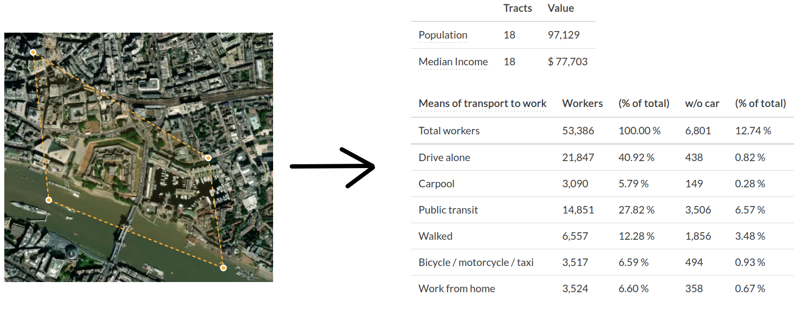

# Census data for any boundary polygon

# What

- Web tool: Draw a boundary, get demographic breakdown of people living there
- and an API: from any language, give a boundary polygon, and get demographic breakdown
- Worldwide scope, "pay as you go" model for data

# Why

- How many people live near a bus stop or bike-share station?
  - Between 18-30, employed, not owning a vehicle...
- Who lives inside a proposed low-traffic neighborhood, or nearby where traffic is expected to detour in the short-term?
- Are air-quality sensors equitably distributed? <https://github.com/alan-turing-institute/spatial-inequality>

Many researchers reinventing the same wheel -- why?

# How (the data)

- One pipeline transforming region-specific data sources into one format
  - [US census](https://www.nhgis.org) (census block)
  - UK census (output area)
  - [Brazil](https://www.ibge.gov.br/en/statistics/social/population/22836-2020-census-censo4.html?=&t=o-que-e) (enumeration area)
  - etc
- Use the smallest geography available
- [WorldPop](https://www.worldpop.org/project/categories?id=3) fallback

# How (the code)

- idea: store in one [FlatGeobuf](https://flatgeobuf.org) file
  - [Proof of concept for US census blocks by Michael Kirk](https://github.com/a-b-street/abstreet/blob/master/popdat/scripts/build_population_areas.sh)
  - HTTP range requests to cheaply fetch what's needed (3-4MB over 8-10 requests for one small city)
  - no hosted API to productionize; just a file!
- Rust client library
  - Bindings for any language, cross-platform, WebAssembly, Jupyter notebooks

# Alternatives considered

- Commercial: [Remix](https://www.remix.com/blog/deeper-data-analysis-with-remixs-breakdown-tables), [HASTUS](https://youtu.be/cKXoj6_LY2s?t=61)
- [Transitland](https://www.transit.land/routes/r-c23nb-48#export)
- Bespoke libraries for certain regions
  - [geobr](https://ipeagit.github.io/geobr/index.html)
  - [nomisr](https://github.com/ropensci/nomisr)
- [IPUMS](https://international.ipums.org/international/sda.shtml)

<!-- I'm having trouble finding the part of Transitland that deals with census data. https://pkg.go.dev/github.com/interline-io/transitland-server/find#CensusGeographySelect -->
