# Intro

[Straßenraumkarte Neukölln](https://supaplexosm.github.io/strassenraumkarte-neukoelln/?map=micromap#20/52.49555/13.42073) changed everything for me

## About me

- A/B Street since 2018
- Alan Turing Institute since December 2021

## A losing battle

<https://a-b-street.github.io/docs/tech/map/geometry/index.html>

:::: {.columns}
::: {.column width="50%"}

:::
::: {.column width="50%"}

:::
::::

## Talk outline

- Why OSM can't represent road geometry
- Thought experiment: a schema from scratch
- Practical next steps
- Discussion

# Part 1: Why

<https://www.openstreetmap.org/node/8909891523>

## In A/B Street

## Does it really have to be so complicated?

## The OSM schema now

- Road center-lines as ways, flat key=value strings
- Cyclepaths and sidewalks might be mapped separately
- Divided one-ways / dual carriageways are split when there's a physical median

## Does this schema serve classic uses well?

- Tagging
- Rendering
- Routing

## Tagging / editing

- Easy to start with, but all the complicated situations
- When splitting into a dual-carriageway, people often forget to adjust number of lanes or `sidewalk=both`
- No end to questions about sidewalks/cycleways as attributes vs a separate way
- Edge cases like <https://osmus.slack.com/archives/C2VJAJCS0/p1645748754848769>

## Arbitrary modeling choices

:::: {.columns}
::: {.column width="50%"}
<https://www.openstreetmap.org/#map=19/47.63818/-122.31442>

:::
::: {.column width="50%"}
<https://www.openstreetmap.org/#map=18/47.53965/-122.33635>

:::
::::

- Can't represent middle of road at splits/joins

## Arbitrary modeling choices

- What's the speed limit, name, or highway classification of the tiny inner segments?

## Rendering

- At lower zooms, I _think_ Carto tries to simplify "sausage links"?

## Routing

- Probably the best served
- Deduplicating traffic signals for cost
- Simplifying directions through complex junctions

## "Advanced" use cases

## Pedestrian crossings

- <https://www.accessmap.io>, Open Sidewalks, Project Sidewalk
- sidewalk width and curb cuts
- sidewalk width isn't constant
- the shape near bus shelters, rubbish bins, other obstacles

## Sidewalk width matters

- Social distancing on sidewalks?
  - Extended pavements in London for COVID
- Madrid: <https://distanciamiento.inspide.com/>
- New York: <https://www.sidewalkwidths.nyc/#13/40.714/-74.005>
- São Paulo: <https://github.com/a-b-street/abstreet/issues/859>

## CAD

- <https://secure.manchester.gov.uk/download/downloads/id/28198/the_crescent_1.pdf>

## Traffic simulation

- Understand a junction as one logical object for signal timing, turning movements

## Road space reallocation

- <https://streetmix.net/> on each half of a divided highway

## Does anybody in industry care?

- HD mapping companies, autonomous vehicles
- Remix (<https://nyc25x25.org/brooklyn.html>)

## Appendix: Attempts to fix the current schema

- [area:highway](https://wiki.openstreetmap.org/wiki/Key:area:highway)
- [junction=intersection](https://wiki.openstreetmap.org/wiki/Proposed_features/junction%3Dintersection)
- <https://wiki.openstreetmap.org/wiki/Proposed_features/Street_area>

# Part 2: Let's start over

Forget OSM entirely for the moment

## We want a representation that...

1. shows geometry pretty accurately
2. lets you understand hierarchy -- entire junction, just the north approaching road and its crossing islands, individual lanes, stopping line
3. represents routing / turn restrictions
4. represents semantics that apply over space (loading zones, no parking overnight)

## Test cases

Here are some things it has to handle

## Complex junctions

<https://www.openstreetmap.org/node/5220776402>

## Bike lanes crossing a slip lane

<https://www.openstreetmap.org/node/4694379084>

## London's weird bike infrastructure

:::: {.columns}
::: {.column width="50%"}

:::
::: {.column width="50%"}

:::
::::

## Contraflow cycle entrances

<https://www.openstreetmap.org/node/3194001392>

## Crossing islands

:::: {.columns}
::: {.column width="50%"}

:::
::: {.column width="50%"}

:::
::::

## Pocket parking

## Bulb outs

<https://www.sfbetterstreets.org/find-project-types/pedestrian-safety-and-traffic-calming/traffic-calming-overview/curb-extensions/>

## Let's just draw stuff

## Borough station

## Borough station

## Subdivide space

- One road object
  - left side
    - lanes
    - grass verge
    - separate cycle track
    - pavement
  - median / crossing island
  - right side
- Attributes (or even... a JSON object) per piece

## Subdivide space

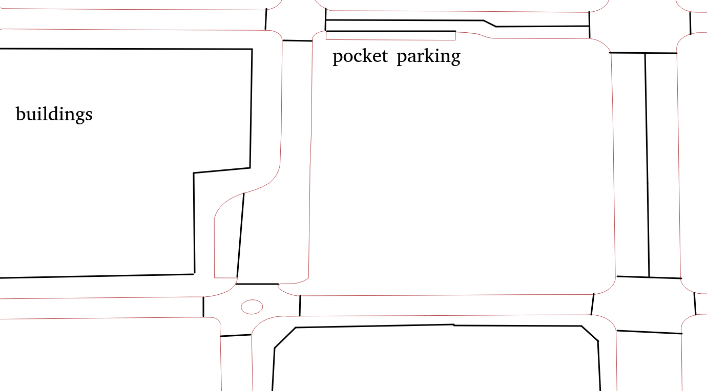

## Boundaries of adjacent polygons

- When polygons share a boundary, use linear referencing to mark an interval of it
- Add attributes (cough JSON cough) to it
- Curb cuts, turns
- If it's thick enough, subdivide into a polygon

## Boundaries of adjacent polygons

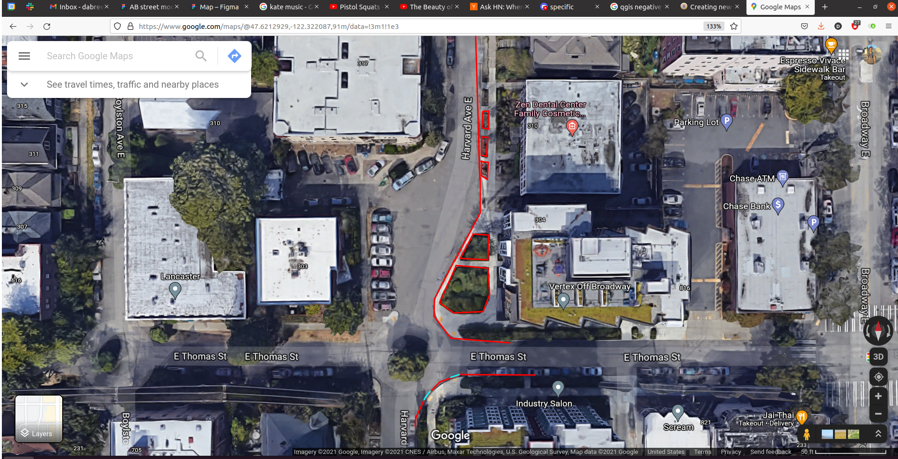

## Linear vs freeform movement

- Calculate straight-skeletons?
- Or also have the classic center lines

## Questions

- some CAD or drawing program to subdivide space, snap lines easily?
- game engines: navmeshes?

# Part 3: Practical next steps

## Would this be hard to map?

- in ID or JOSM, oh yeah
- dedicated UI
  - first step: just draw a linestring over satellite, quickly thicken it or shift left/right
  - when width varies, creating bulges and dragging them?

## Pay as you go / a migration plan

If we did come up with a new schema, we don't need to start mapping from scratch

1. Continue mapping the road center with lane attributes
2. Use osm2lanes + A/B Street's road/intersection geometry heuristics
3. Use the dedicated UI to correct mistakes / add detail

## Satellite imagery

- Sufficient to map this kind of detail?
- Tree cover and building shadows
- Any easy-to-use computer vision tools for snapping lines to edges or segmenting?

## What other data is sometimes available?

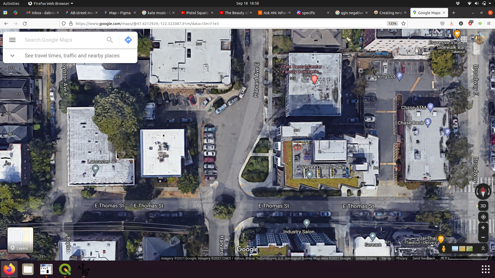

## Seattle

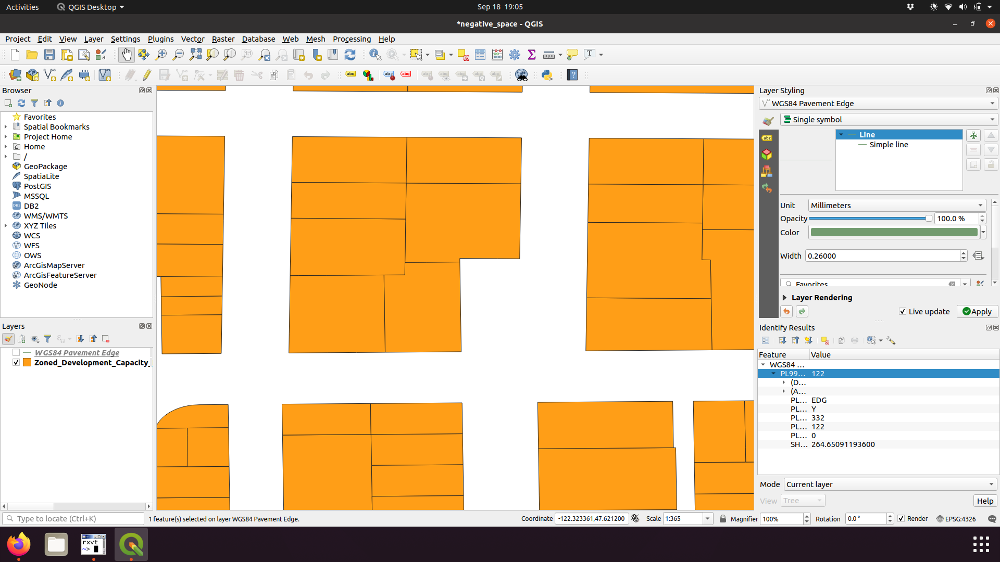

## Seattle

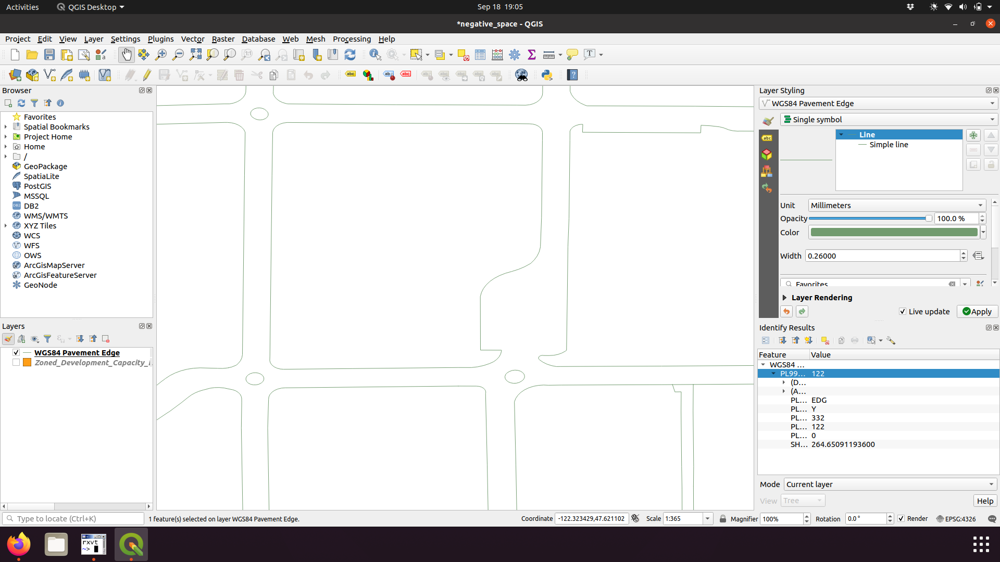

## Seattle

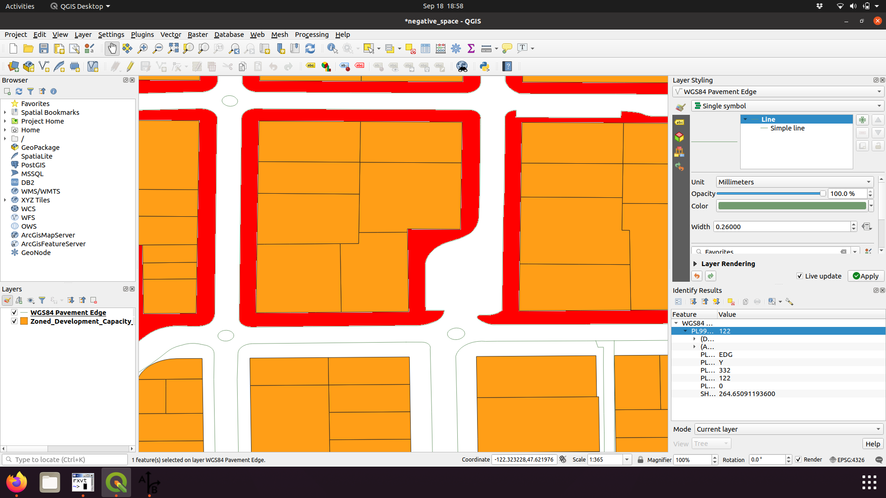

## Seattle

- [Parcels](https://data-seattlecitygis.opendata.arcgis.com/datasets/parcels-1)
- [Pavement edges](https://data.seattle.gov/dataset/Pavement-Edge-zip/gy82-cq84)
- [Channelization](https://data-seattlecitygis.opendata.arcgis.com/datasets/channelization-file-geodatabase/about)

## London

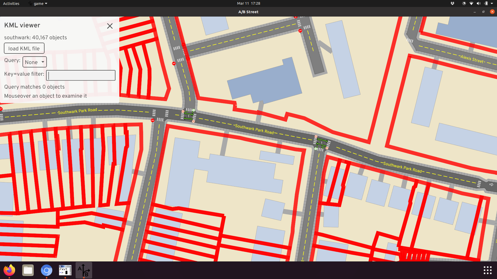

- [INSPIRE parcels](https://use-land-property-data.service.gov.uk/datasets/inspire)

## São Paulo

- <https://github.com/spstreets/OD2017/releases/download/1/sw.gpkg> and <https://github.com/spstreets/OD2017/releases/download/1/streets.gpkg>
- Thanks to [Lucas](https://github.com/lucasccdias)

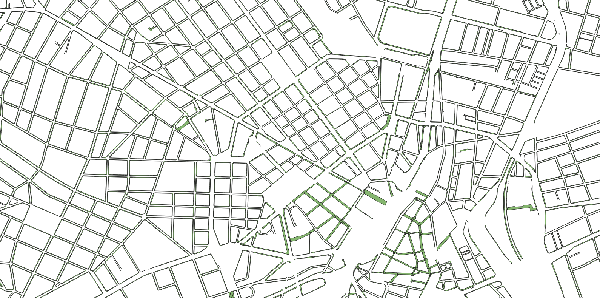

## São Paulo

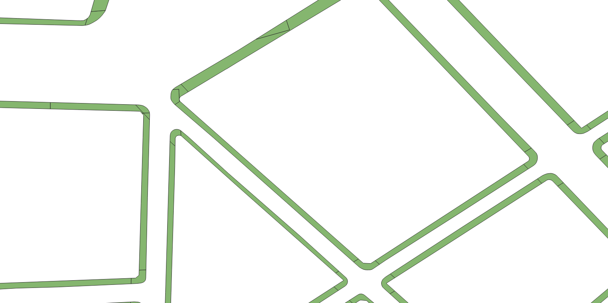

## São Paulo

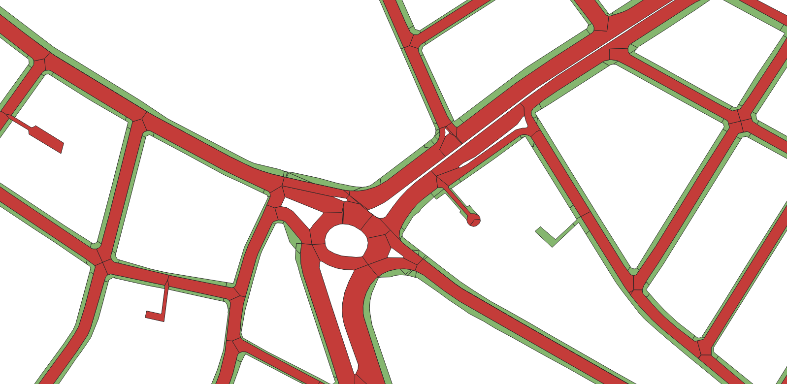

## Landuse polygons

<https://www.openstreetmap.org/relation/1277566#map=17/51.47069/-2.52027>

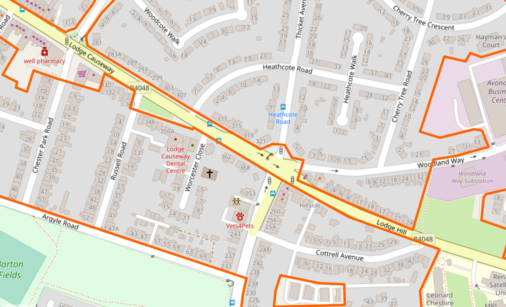

## A modest proposal

- Estimate width
  - Start from OSM center-line
  - Project left until you hit something
  - Repeat for right
  - Shift the center-line to actually be centered

## More data

- [Montana cadastral](http://svc.mt.gov/msl/mtcadastral/) thanks to Jesse Crocker
- [Des Moines planimetrics](https://www.dsm.city/city_of_des_moines_gis_data/index.php) via Justin Gruca
- [Denver planimetrics](https://wiki.openstreetmap.org/wiki/Denver_Planimetrics_Import) via Minh Nguyen
- San Jose [sidewalk polygons](https://gisdata-csj.opendata.arcgis.com/datasets/sidewalk/explore?location=37.332265%2C-121.889490%2C17.00) and [curbfaces](https://gisdata-csj.opendata.arcgis.com/datasets/CSJ::curbfaces/about) from Minh
- [Ohio](https://wiki.openstreetmap.org/wiki/Ohio/Imports#Potential_resources) from Minh
- NYC [land use map](https://zola.planning.nyc.gov/about/#9.72/40.7125/-73.733) and [street plans](https://streets.planning.nyc.gov/about) from Maxim
- [Madrid social distancing on sidewalks](https://distanciamiento.inspide.com/)
- [OpenAddresses](https://openaddresses.io/) collects parcel data now too

## Negative space

- Nothing but buildings?
  - Group into a block
  - Take a concave hull
  - Widen road center-lines until they hit
- Not advocating for full automation / imports
  - Human/machine collaboration, just a better tool

## Appendix: other resources

- <https://www.ian-ko.com/ET_SolutionCenter/gw_derive_setback_areas.htm>
- <https://desktop.arcgis.com/en/arcmap/10.3/manage-data/editing-parcels/workflow-migrating-road-centerlines.htm>

## Conclusion

- My next step: turn <https://a-b-street.github.io/docs/tech/map/geometry/index.html> into a library, like osm2lanes
- Contact me: <dabreegter@gmail.com>
- These slides: <https://dabreegster.github.io/talks/map_model_v2/slides.html>
- Slides are on Github: <https://github.com/dabreegster/talks>
