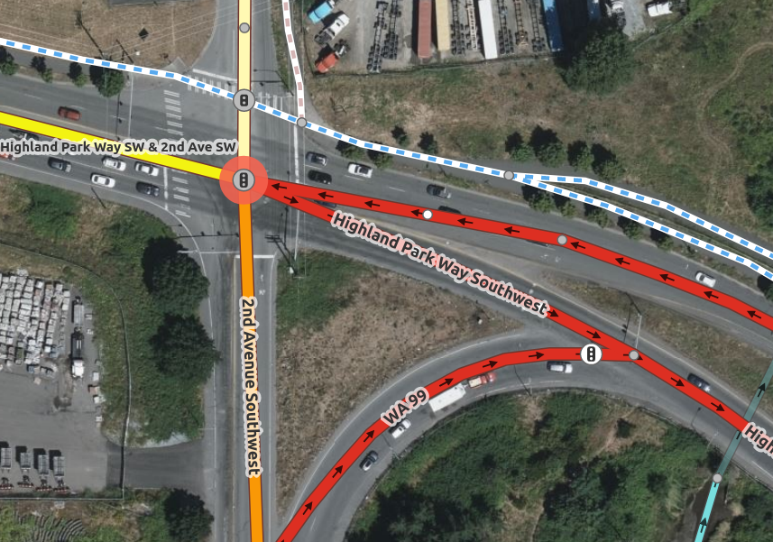

# Intro

<!-- What would it take to scale Straßenraumkarte Neukölln everywhere? The OpenStreetMap data model does not easily represent complex junctions, crossing islands, contraflow cycle lanes, pocket parking, bulb-outs, etc. Let's brainstorm what a new schema for representing complex 2D street space could be and how we could render and edit it. We'll then talk about a few practical ways to move towards this schema with OSM. 30 min presentation, 30 min discussion -->

[Straßenraumkarte Neukölln](https://supaplexosm.github.io/strassenraumkarte-neukoelln/?map=micromap#20/52.49555/13.42073) changed everything for me

## About me

- A/B Street since 2018
- Alan Turing Institute since December 2021

## A losing battle

<https://a-b-street.github.io/docs/tech/map/geometry/index.html>

:::: {.columns}
::: {.column width="50%"}

:::
::: {.column width="50%"}

:::
::::

## Talk outline

- Why OSM can't represent road geometry
- Thought experiment: a schema from scratch
- Practical next steps
- Discussion

# Part 1: Why

<https://www.openstreetmap.org/node/8909891523>

## In A/B Street

## Does it really have to be so complicated?

## The OSM schema now

- Road center-lines as ways, flat key=value strings
- Cyclepaths and sidewalks might be mapped separately
- Divided one-ways / dual carriageways are split when there's a physical median

## Does this schema serve classic uses well?

- Tagging
- Rendering
- Routing

## Tagging / editing

- Easy to start with, but all the complicated situations
- When splitting into a dual-carriageway, people often forget to adjust number of lanes or `sidewalk=both`
- No end to questions about sidewalks/cycleways as attributes vs a separate way
- Edge cases like <https://osmus.slack.com/archives/C2VJAJCS0/p1645748754848769>

## Arbitrary modeling choices

:::: {.columns}
::: {.column width="50%"}
<https://www.openstreetmap.org/#map=19/47.63818/-122.31442>

:::
::: {.column width="50%"}
<https://www.openstreetmap.org/#map=18/47.53965/-122.33635>

:::
::::

- Can't represent middle of road at splits/joins

## Arbitrary modeling choices

- What's the speed limit, name, or highway classification of the tiny inner segments?

## Rendering

- At lower zooms, I _think_ Carto tries to simplify "sausage links"?

## Routing

- Probably the best served
- Deduplicating traffic signals for cost
- Simplifying directions through complex junctions

## "Advanced" use cases

## Pedestrian crossings

- <https://www.accessmap.io>, Open Sidewalks, Project Sidewalk
- sidewalk width and curb cuts
- sidewalk width isn't constant
- the shape near bus shelters, rubbish bins, other obstacles

## Sidewalk width matters

- Social distancing on sidewalks?
  - Extended pavements in London for COVID
- Madrid: <https://distanciamiento.inspide.com/>
- New York: <https://www.sidewalkwidths.nyc/#13/40.714/-74.005>
- São Paulo: <https://github.com/a-b-street/abstreet/issues/859>

## CAD

- <https://secure.manchester.gov.uk/download/downloads/id/28198/the_crescent_1.pdf>

## Traffic simulation

- Understand a junction as one logical object for signal timing, turning movements

## Road space reallocation

- <https://streetmix.net/> on each half of a divided highway

## Does anybody in industry care?

- HD mapping companies, autonomous vehicles
- Remix (<https://nyc25x25.org/brooklyn.html>)

## Appendix: Attempts to fix the current schema

- [area:highway](https://wiki.openstreetmap.org/wiki/Key:area:highway)
- [junction=intersection](https://wiki.openstreetmap.org/wiki/Proposed_features/junction%3Dintersection)
- <https://wiki.openstreetmap.org/wiki/Proposed_features/Street_area>

# Part 2: Let's start over

Forget OSM entirely for the moment

## We want a representation that...

1. shows geometry pretty accurately
2. lets you understand hierarchy -- entire junction, just the north approaching road and its crossing islands, individual lanes, stopping line
3. represents routing / turn restrictions
4. represents semantics that apply over space (loading zones, no parking overnight)

## Test cases

Here are some things it has to handle

## Complex junctions

<https://www.openstreetmap.org/node/5220776402>

## Bike lanes crossing a slip lane

<https://www.openstreetmap.org/node/4694379084>

## London's weird bike infrastructure

:::: {.columns}
::: {.column width="50%"}

:::
::: {.column width="50%"}

:::
::::

## Contraflow cycle entrances

<https://www.openstreetmap.org/node/3194001392>

## Crossing islands

:::: {.columns}
::: {.column width="50%"}

:::
::: {.column width="50%"}

:::
::::

## Pocket parking

## Bulb outs

<https://www.sfbetterstreets.org/find-project-types/pedestrian-safety-and-traffic-calming/traffic-calming-overview/curb-extensions/>

## Let's just draw stuff

Just try to partition 2D space into objects, label the areas with some attributes

## Borough station

## Borough station

## Borough station

## Connections / tagged things along the boundary of adjacent polygons

Show curb height and stuff. If it's too thin, just treat it as a boundary

## Linear vs freeform movement

Calculate straight-skeletons or something, or add back in the center lines for the simple case

When turn lanes start/end, where should we draw it?

## Does this schema hold up?

Kind of like the pipes and connectors proposal

No attempt at 3D

- stress tests / go thru examples from geom article like taiwan

## Simpler alt: center lines with width

Varying width based on linear referencing? Cav contour "bulges"?

## Appendix: other possible inspirations

- navmeshes
- 3D engines

# Part 3: Is this practical?

## Would this be hard to map?

- in ID or JOSM, oh yeah
- needs a UI dedicated to it. what might that look like?
  - demo of thickening lines over satellite
  - when width varies, creating bulges and dragging them? do people know examples from CAD / 3d modeling?
- pay as you go
  - just tag the center line, classic quick lane count
  - do the abst approach: desperate heuristics, show it
  - if the UI for adding detail is easy, people will do it, use that instead of inference

## Satellite imagery

- is this enough?
- tree cover

## machine learning

- from satellite or streetview
- sure, I'm not familiar here, not seen any widespread demos, just papers

## What other data is sometimes available?

### seattle

- Parcels, https://data-seattlecitygis.opendata.arcgis.com/datasets/parcels-1
- Pavement edges, https://data.seattle.gov/dataset/Pavement-Edge-zip/gy82-cq84
- Channelization?! https://data-seattlecitygis.opendata.arcgis.com/datasets/channelization-file-geodatabase/about

### london

- parcels, https://use-land-property-data.service.gov.uk/datasets/inspire
  - good enough or not?

### São Paulo

- https://github.com/spstreets/OD2017/releases/download/1/sw.gpkg and https://github.com/spstreets/OD2017/releases/download/1/streets.gpkg

### Montana

- http://svc.mt.gov/msl/mtcadastral/ (Jesse Crocker)

### Des Moines

https://www.dsm.city/city_of_des_moines_gis_data/index.php planimetrics (Justin Gruca)

### Denver

https://wiki.openstreetmap.org/wiki/Denver_Planimetrics_Import (Minh Nguyen)

### San Jose

https://gisdata-csj.opendata.arcgis.com/datasets/sidewalk/explore?location=37.332265%2C-121.889490%2C17.00 sidewalk polygons (Minh)
and curbfaces https://gisdata-csj.opendata.arcgis.com/datasets/CSJ::curbfaces/about

### Ohio

https://wiki.openstreetmap.org/wiki/Ohio/Imports#Potential_resources various (Minh)

### NYC

https://zola.planning.nyc.gov/about/#9.72/40.7125/-73.733
https://streets.planning.nyc.gov/about (Maxim)

### Madrid

https://distanciamiento.inspide.com/

### landuse polygons

https://www.openstreetmap.org/relation/1277566#map=16/51.4718/-2.5168

### more parcel

[OpenAddresses](https://openaddresses.io/)

## Negative space

Get even more radical. If we have nothing but buildings, group them into a block, take some kind of concave hull. Widen road center-lines until they hit.

This is an example where full automation wouldn't work. The pay-as-you-go / tool-assisted model. Someone opens an editor somewhere in OSM, uses this tool to produce a guess, then adjusts and uploads it

# Conclusion

actually doing this in OSM -- migration plan? keep old software working? cultural split?

steps in this direction for the pay-as-you go model: osm2lanes and osm2polygons

## Appendix: other resources

https://www.ian-ko.com/ET_SolutionCenter/gw_derive_setback_areas.htm
https://desktop.arcgis.com/en/arcmap/10.3/manage-data/editing-parcels/workflow-migrating-road-centerlines.htm

is the osm data model creaking?

https://wiki.openstreetmap.org/wiki/Talk:Key:area:highway#Proposal_for_revision_to_wiki_article
https://geo.dianacht.de/topo/?zoom=19&lat=48.15112&lon=11.46511

## TODO: how does the Neukölln map work?
