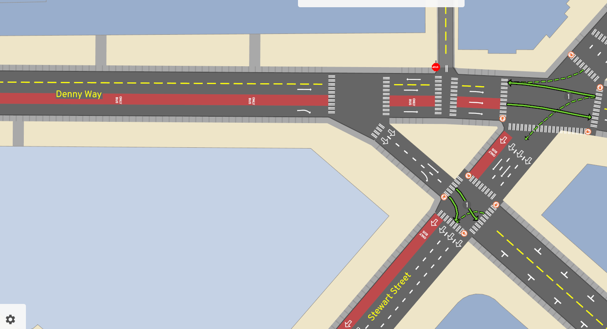
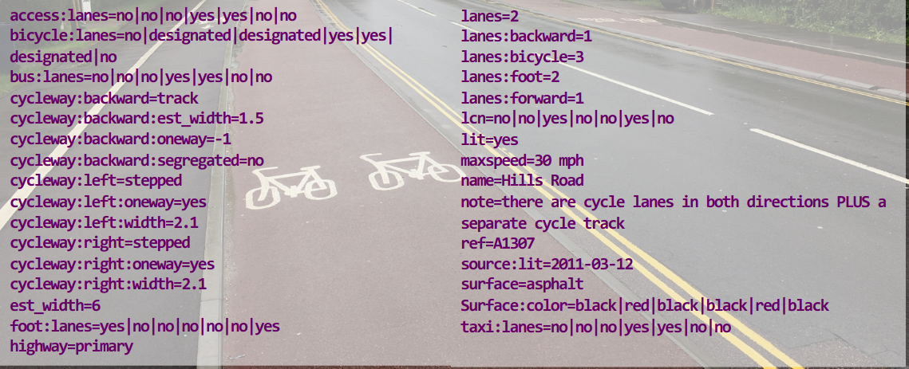

# Intro

- These slides: <https://dabreegster.github.io/talks/osm2lanes/slides.html>
- Contribute: <https://github.com/dabreegster/talks>

## About Dustin

- <https://twitter.com/CarlinoDustin>
- A/B Street since 2018
- Alan Turing Institute since December 2021

## About Michael

- <https://github.com/a-b-street/osm2lanes>
- <https://www.openstreetmap.org/user/droogmic>
- Software Engineer, ASML, Netherlands

## Talk outline

1.  Background
2.  How it works today
3.  Complications
4.  Next steps / contributing

# Part 1: Background

## A/B Street

:::: {.columns}
::: {.column width="40%"}

:::
::: {.column width="60%"}
- a bunch of tools to explore less cars in cities
- all work off a heavily processed map representation
    - road and intersection geometry
    - driveways between buildings and roads, parking lot capacity
    - turn restrictions, traffic signal timing, routing
:::
::::

## Edit roads


## Simulate traffic


## Plan bike networks

[bike.abstreet.org](http://bike.abstreet.org)


## Low-traffic neighborhoods

[ltn.abstreet.org](http://ltn.abstreet.org)


## Sharing code

- <https://github.com/a-b-street/abstreet/discussions/789>
- <https://github.com/a-b-street/abstreet/blob/master/raw_map/src/lane_specs.rs>
- Other projects looking at OSM lanes in detail
  - StreetComplete, Map Machine, Bjorn's JOSM plugin, shared-row, Cycle Streets, 3D Street

## Why's this hard?



- [Cyclestreets: Is the OSM data model creaking?](https://www.cyclestreets.org/news/2019/09/22/sotm2019/)

## Why does it have to be hard?

From left to right:

```
[
  { type=sidewalk, surface_color=black },
  { curb },
  { type=cycle, direction=forward, surface_color=red, est_width=1.5 },
  { curb },
  { type=travel, surface_color=black, direction=forward, allow taxi },
  { type=travel, surface_color=black, direction=backward, allow taxi },
  { curb },
  { type=cycle, direction=forward, surface_color=red, est_width=1.5 },
  { curb },
  { type=sidewalk, surface_color=black },
]
```

- Arguments for mapping as separate ways
  - geometry: doesn't help
  - per-lane detail: yes!

## End-user stories

- vector map of whole world showing lane tagging
- Streetmix style editor for lane tagging
  - <https://github.com/openstreetmap/iD/issues/387>
- both of these help improve lane tagging
- road space studies
  - 60% of width used by 20% of people

# Part 2: How it works today

Web demo: <https://a-b-street.github.io/osm2lanes>

## Input

- One way's key/values
- left- or right-handed driving?
- country code (for inferring lane widths, colors)

## Output

<https://www.openstreetmap.org/way/22760280>

```
{
  "Ok": {
    "road": {
      "lanes": [
        {
          "type": "travel",
          "direction": "backward",
          "designated": "bicycle",
          "width": null
        },
        {
          "type": "separator",
          "markings": [
            {
              "style": "solid_line",
              "width": 0.2,
              "color": "white"
            }
          ]
        },
        {
          "type": "travel",
          "direction": "backward",
          "designated": "motor_vehicle",
          "width": null
        },
        {
          "type": "separator",
          "markings": [
            {
              "style": "dotted_line",
              "width": 0.2,
              "color": "white"
            }
          ]
        },
        {
          "type": "travel",
          "direction": "forward",
          "designated": "motor_vehicle",
          "width": null
        },
        {
          "type": "separator",
          "markings": [
            {
              "style": "solid_line",
              "width": 0.2,
              "color": "white"
            }
          ]
        },
        {
          "type": "travel",
          "direction": "forward",
          "designated": "bicycle",
          "width": null
        }
      ],
      "highway": {
        "highway": {
          "Classified": "Secondary"
        },
        "lifecycle": "Active"
      }
    },
    "warnings": [
      "unimplemented: access, bicycle=designated"
    ]
  }
}
```

## Output

- type
  - travel, parking, shoulder, separator
- designated
  - foot, bike, motor vehicle, bus
- direction
  - forward, backward, both
- width
- markings / separators

## Inverse, lanes2osm

- An easier OSM lanes editor
  - Pick a way, grab its tags
  - osm2lanes
  - Edit the lanes with something Streetmix-like
  - lanes2osm
  - Upload the diff
- Complications?

## Code overview

- <https://github.com/a-b-street/osm2lanes>
- Rust, Python, and Kotlin
- Originally...
  - make it easy for people to get involved, no matter the preferred language
  - "not hard" to keep the implementations in-sync
- Going forward...
  - Rust can target any build environment

## Tests!

<https://github.com/a-b-street/osm2lanes/blob/main/data/tests.yml>

## Code walkthrough

- [Lane schema](https://github.com/a-b-street/osm2lanes/blob/main/rust/osm2lanes/src/road/lane.rs)
- [broken down by mode](https://github.com/a-b-street/osm2lanes/blob/03afea4f6272568e2b91e6e575945e58e2654aa7/rust/osm2lanes/src/transform/tags_to_lanes/mod.rs#L382)
  - special case non-motorized paths
  - bus
  - bike
  - parking
  - sidewalks / shoulders
- build up from inside-to-out, both sides of the road
- insert separators afterwards

## Inferred values

- Direct tagged data
- Stuff we assume as a reasonable default
- ... locale-specific config
- Calculated from a tagged value (splitting total width over all the lanes)

# Part 3: Complications

## Designated vs allowed

- Footpaths allowing, but not prioritizing, cyclists
- Bus lanes allowing cyclists

## Errors are rampant

- <https://www.openstreetmap.org/way/389322095>

```
unsupported: cycleway=* with any cycleway:* values


bicycle = designated
cycleway = lane
cycleway:left = separate
cycleway:right = lane
highway = secondary
lanes = 4
lanes:backward = 2
lanes:forward = 2
lcn = yes
maxheight = default
maxspeed = 25 mph
name = Dexter Avenue North
oneway = no
surface = paved
```

## Separate ways

<https://www.youtube.com/watch?v=LatorN4P9aA>

- Punt to the caller, feed in all of the ways?
  - next talk will go into more detail
  - just look for everything in between buildings/parks/water?
- also provide geometry, so we can glue things together in the right order?
- inferred separators
  - or <https://wiki.openstreetmap.org/wiki/Talk:Proposed_features/cycleway:separation>

# Part 4: Next steps / contributing

## Test cases

- Particularly cycleway buffers, <https://wiki.openstreetmap.org/wiki/Berlin/Verkehrswende/Radwege#Tagging-Beispiele>

## Locales

- <https://github.com/streetcomplete/StreetComplete/tree/master/res/country_metadata>

## Web map

<https://github.com/a-b-street/osm2lanes/blob/main/web/index.html>

- Click a road, see its lanes in cross-section view
- Rust <-> Javascript API
- Publish on npm

## Per-lane width

- Use it when it's tagged
- If we know the curb-to-curb width or entire road width...
  - sanely distribute width to known lanes

## Per-lane data

- turn:lanes
- allowed vehicles (bus lanes with bikes or taxis)
- time-restricted turns or parking
- surface type
