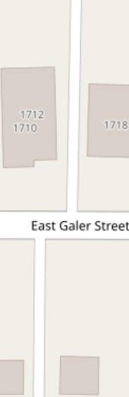
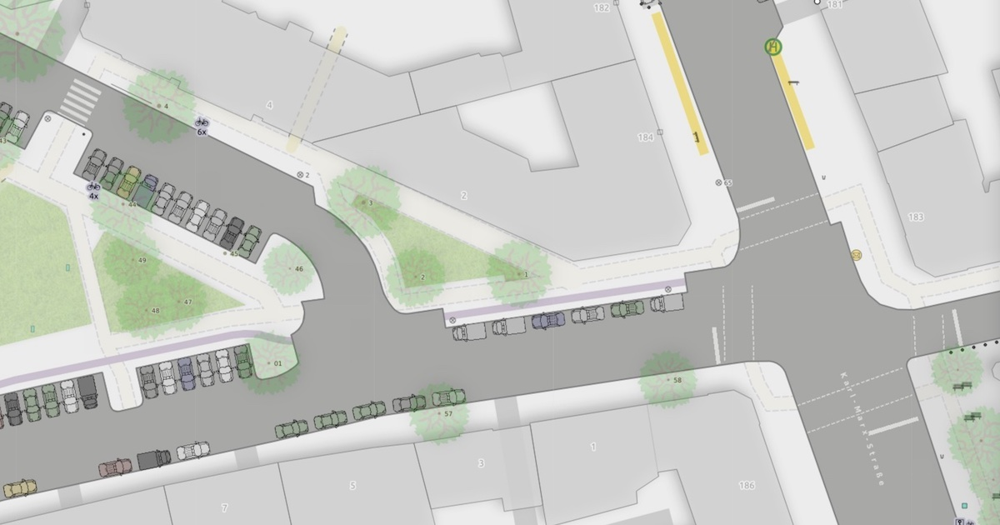
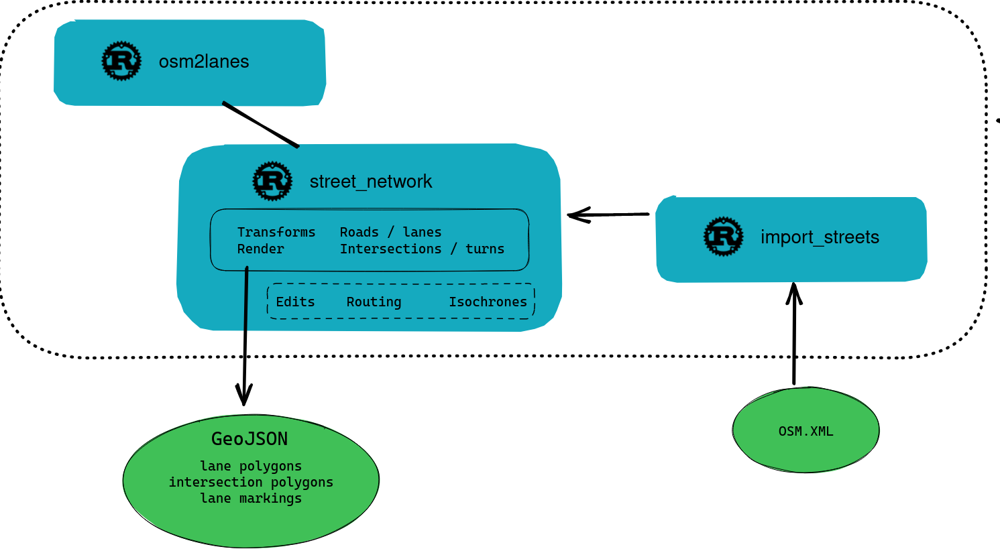
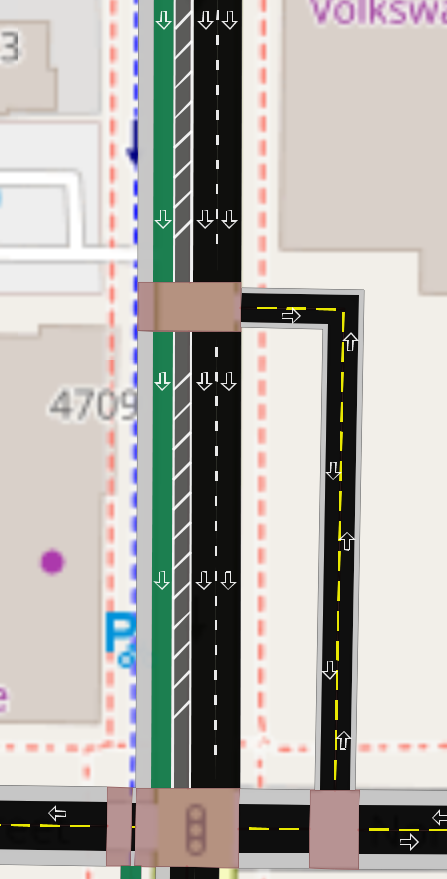

# Talk outline

- Background
- What osm2streets does
- Example transformations
- Challenges and next steps

<!-- ....................................................................... -->

# Background

## My general story

- Quit big tech in 2018
- Open source software to...
  - Transition cities away from motor vehicles, towards walking, cycling, public transit
  - Engage communities in designing, not just voting/approving

## A/B Street

:::: {.columns}
::: {.column width="50%"}

:::
::: {.column width="50%"}

:::
::::

## A/B Street

- Squeeze detail out of OSM -- individual lanes, turns
- Guess missing data
  - Sidewalks, crosswalks
  - Infer traffic signal timing, number of parking spaces
- Two modelling choices in OSM cause havoc over and over

## Problem 1: short roads

:::: {.columns}
::: {.column width="50%"}

:::
::: {.column width="50%"}
- OSM represents roads as a center-line
- Some segments of that are the middle of an intersection
- "Dog legs" -- almost a 4-way intersection
- Also between dual carriageways
:::
::::

## Problem 2: parallel roads, separate objects


## Problem 2: parallel roads, separate objects

- A different way for each side of a dual carriageway, cycletracks with some protection from the road, sidewalks
- Why tag this way?
  - More detail
  - String key=value schema makes tagging one object awkward
    - (Would JSON, nested lists help?)
  - 3 years ago: [Is the OSM data model creaking?](https://2019.stateofthemap.org/sessions/DW7WW8/) by CycleStreets

## Consequences: rendering


- 8 intersections
- 10 road segments that're really part of the intersection

## Consequences: rendering


Not ideal, but still usable

## Consequences: rendering


Sometimes parallel roads with inferred width will physically overlap

## Consequences: traffic simulation


## Consequences: traffic simulation


## Consequences: editing a road's lanes


## Consequences: tracing between roads


## Consequences: tracing between roads


## Consequences: other projects


- Cycling Infrastructure Prioritisation Toolkit says Blackfriars need a cycle lane
- Routing instructions / how many traffic signals crossed

## Inspiration



- The state of the art by Berlin OSM community
- <https://strassenraumkarte.osm-berlin.org/?map=micromap#20/52.49555/13.42073>
- Pocket parking, curb bulbs, complex junctions

## Inspiration


Can we do this everywhere?

## One common problem

- Each of these problems might have a workaround for each domain
  - (But it might be very complicated...)
- What if there's a better data model to consume instead of OSM directly?
- What if we can solve all of these problems at once?

<!-- ....................................................................... -->

# What osm2streets does

## The demo: Tempe


## The demo: St George's cycletrack


## The schema

- Roads
  - A center line-string, but thickened with a total width
  - A list of lanes from left-to-right
    - Type (general travel lane, bus lane, cycle lane, parking, sidewalk, grass median, striped buffer with bollards)
    - Width
    - Direction
    - Derived geometry: a thickened line-string

## The schema

- Intersections
  - Complexity classification: regular crossing, uninterrupted connection (turn lane appears), multi-connection (a dual carriageway splits), terminus (dead-end)
  - Control: uncontrolled, stop signs, signalized
  - A polygon
    - The roads exactly meet this polygon at a right angle
  - Movements through the intersection

## The schema

- Partly a graph (routing)
  - Not a simple one: turn restriction relations with multiple `via` ways
- Semantics
  - Is the cycle lane protected from traffic?
- Geometry

## The architecture



## The architecture


## How it works

1.  Parse OSM XML, extract raw data
2.  Split ways into road segments (giving a graph with tags on edges)
3.  Lanes per road segment
  - *Still using one big function (with unit tests)*
  - *Proper rewrite: [osm2lanes](https://github.com/a-b-street/osm2lanes)*
  - *Sidewalks are often not tagged, make some configurable guesses*

## How it works

4.  Transformations to fix various problems
  - *collapse "degenerate" intersections between 2 roads*
  - *find and merge "short" roads into one intersection*
  - *collapse simple "sausage link" patterns*
  - *detect and collapse more general dual carriageways*
  - *if all else fails, shrink physically overlapping roads*
  - *merge parallel cyclepaths with the main road*
5.  Generate polygons for the intersections and roads
  - "Trim back" the road center-line from the intersection

## How you can use it: OSM community

- a new renderer for your hard work
- validation for lane tagging
- WIP: osm2lanes editor, don't learn complex lane tagging


## How you can use it: GIS

  - Export the polygons, use in your QGIS projects


## How you can use it: OSM tool authors

- Call the library from any language and build anything on top of it!
  - Working: Rust, JavaScript / browser
  - Planned: Java, Python, R
  - Worst case: call a command-line tool
- Contribute upstream to fix the hard problems

## How you can use it: OSM tool authors

- The API
  - Import this osm.xml file (or grab from Overpass)
  - Run these transformations to simplify the network
  - Get lane details (so you could define your own routing score function for walking safety/comfort)
  - Render geometry to GeoJSON (polygon areas, lane markings)
  - More later: routing, isochrones, tracing areas between roads

## Technical choices

- Rust: extremely performant, language makes it hard to introduce some bugs, native or web
- Output is just a single file (or in-memory)
  - No databases
  - No complex deployment, just static file hosting
- Up to "city scale"
  - We could look into tiling

<!-- ....................................................................... -->

# Example transformations

## Transformation: simple sausage link


## Transformation: simple sausage link


## Transformation: separate cycletracks


## Transformation: separate cycletracks

```
We're only pattern matching on one type of separate cycleway right now.
This represents a single RawRoad that's parallel to one or more main_roads.

X--X
C  M
C  M
C  X
C  M
C  M
X--X

C is the cycleway segment.
X are intersections.
M are main roads -- note there are two matching up to this one cycleway.
The '-'s are short connector roads between the two.
```

## Transformation: separate cycletracks



## Transformation: dual carriageways


## Using transformations

- Configurable
  - an OSM editor: don't merge intersections or parallel roads
  - routing, rendering, transportation analysis: opt into more

## Writing transformations

- Pattern match on some situation (looking at both graph and geometry)
- Label what's matched for debugging
- Resolution:
  - Graph (remove edges, reconnect something)
  - Geometry (straighten the line between dual carriageways)
  - Lanes (append the lanes from one road onto another, inserting a barrier lane)

## Writing transformations

- Interactive development / debugging
  - Use StreetExplorer and step through (visual print debugging)
- Testing
  - Clip representative OSM examples
  - Catch regressions

<!-- ....................................................................... -->

# Challenges and next steps

## Other features

- Tracing around the block
  - requires edge of the road and intersection polygons
- Routing
  - Score functions for cycling safety/comfort can use detailed lane information
  - How many traffic signals does a route go through?
- Isochrones / 15-minute walk-sheds

## Other features

- Why not Valhalla, GraphHopper, OSRM?
- A/B Street needs this, maybe others do too
  - Need to run in a browser offline, no remote servers
  - Edit the street network and efficiently calculate consequences
- Extra layers (or separate projects) built on top of osm2streets

## osm2lanes editor


## osm2lanes editor

- help needed with osm2lanes itself and the web app (JS)
- prototype as a separate app, but ideally integrate with iD and JOSM

## Promote area:highway tagging

- We'll never algorithmically figure out all the cases
- Make it easier to map the curb or more detail for hard cases
- osm2streets can generate reasonable defaults for most cases
- How can osm2streets use existing tagged areas to override?

## The schema itself

- Lanes aren't thickened linestrings -- the shape could be more detailed
- Crosswalks
- Modal filters / bollards
- Advanced stop lines, bike boxes
- Pedestrian crossing islands

## How you can help

- Programming, integrating the API in your tools, working on the schema, design
- Bug reports (for osm2lanes -- defining the correct result)
- Lane rendering needs design

## Thanks!

- **osm2streets.org**
- <https://github.com/a-b-street/osm2streets>
- <https://github.com/a-b-street/osm2lanes>
- <dabreegster@gmail.com>
- <https://twitter.com/CarlinoDustin>
- These slides: <https://dabreegster.github.io/talks/sotm_2022/slides.html>
- Special thanks to Ben Ritter, Michael Droogleever, Tobias Jordans
