# Intro

- These slides: <https://dabreegster.github.io/talks/tds_seminar_synthpop/slides.html>
- Contribute: <https://github.com/dabreegster/talks>

## About me

- <https://twitter.com/CarlinoDustin>
- A/B Street since 2018
- Alan Turing Institute since December 2021
- Not an expert on demand modeling; I just need it as input
  - Traffic simulation community
  - Transport data science community
  - Videogame industry?! [Watch Dogs: Legion](https://youtu.be/oYUZp4I3ksE?t=225)

## Talk outline

1.  A/B Street quick overview
2.  Travel demand models overview
3.  From UK OD data to a demand model
4.  Activity models
5.  Mode shift
6.  Exercises / discussion

# Part 1: A/B Street overview

## Squeeze detail out of OpenStreetMap

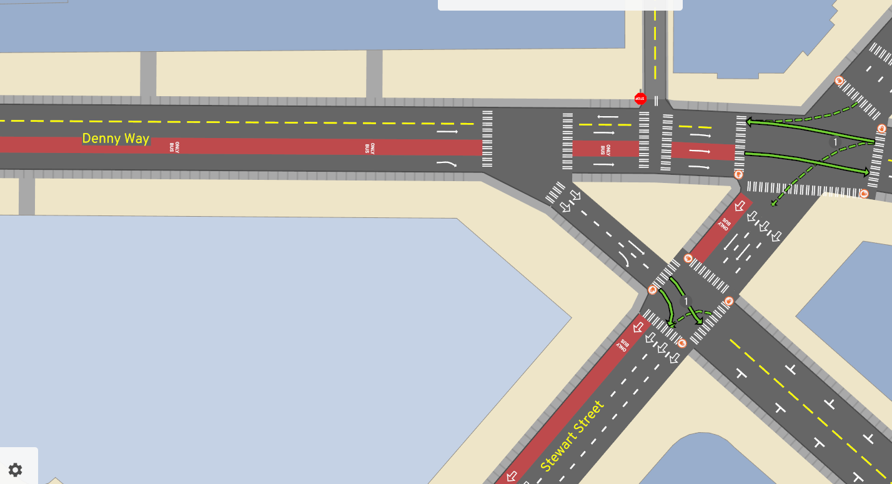

## Edit the infrastructure


## Simulator

[Simulate traffic](https://a-b-street.github.io/docs/software/abstreet.html)


## Plan bike networks

[bike.abstreet.org](http://bike.abstreet.org)


## Low-traffic neighborhoods

[ltn.abstreet.org](http://ltn.abstreet.org)


## 15-minute neighborhoods

[15m.abstreet.org](http://15m.abstreet.org)


## Arcade game, "edutainment"

[santa.abstreet.org](http://santa.abstreet.org)


## Architecture

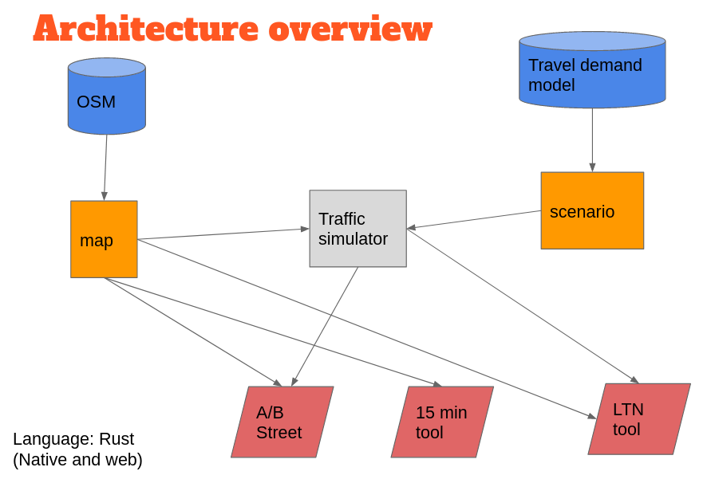

## Architecture


## Components

- [osm2lanes](https://github.com/a-b-street/osm2lanes)
- Planned
  - [osm2polygons](https://a-b-street.github.io/docs/tech/map/geometry/index.html)
  - [census data exploration](https://dabreegster.github.io/talks/census_pitch/slides.html)
  - synthpop tools

# Part 2: Demand model overview

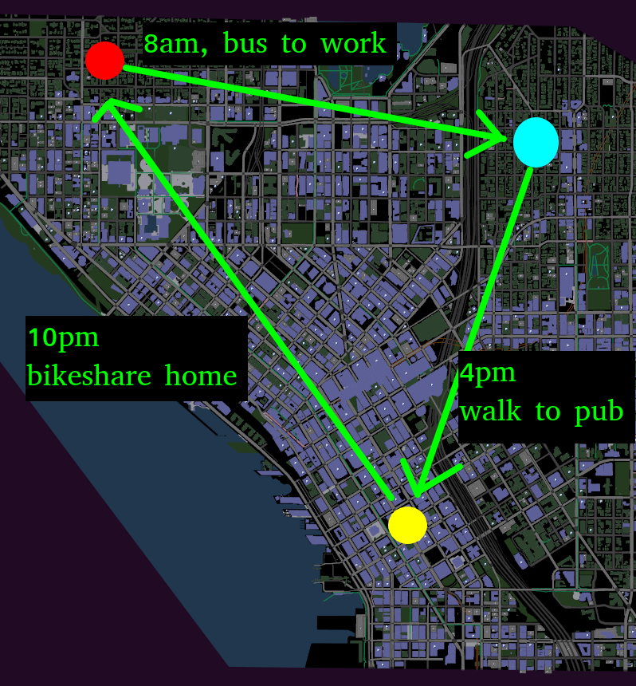

## What

```json
{
  "scenario_name": "minimal",
  "people": [
    {
      "trips": [
        {
          "departure": 10000,
          "origin": {
            "longitude": -122.303723,
            "latitude": 47.6372834
          },
          "destination": {
            "longitude": -122.31905,
            "latitude": 47.63786
          },
          "mode": "Bike",
          "purpose": "Meal"
        },
        {
          "departure": 12000000,
          "origin": {
            "longitude": -122.31905,
            "latitude": 47.63786
          },
          "destination": {
            "longitude": -122.3075948,
            "latitude": 47.6394773
          },
          "mode": "Walk",
          "purpose": "Recreation"
        }
      ]
    }
  ]
}
```

<https://a-b-street.github.io/docs/tech/dev/formats/scenarios.html>

## What

- More attributes about people
  - vehicle ownership
  - routing preference
  - willing to pay toll road
  - comfortable biking up-hills, at night, alongside fast traffic

## What

- One "typical" weekday?
  - Different scenario for weekends, special events
  - People have different travel behavior daily
  - Dangers of disaggregation

## Use cases

- traffic simulation
- low-traffic neighborhoods: where do people drive, to predict detours
- PCT & Ungap the Map: look for short driving trips that might cycle instead
- RAMP: daily behavior in shared spaces for COVID transmission
  - broken down by activity -- entertainment, work, home, retail
  - lockdown behavior, risk at venues

## Some open source travel demand models

- [Soundcast](https://www.psrc.org/activity-based-travel-model-soundcast)
- [NorMITs](https://github.com/Transport-for-the-North/NorMITs-Demand/)
- [grid2demand](https://github.com/asu-trans-ai-lab/grid2demand/)
- [SUMO](https://sumo.dlr.de/docs/Demand/Introduction_to_demand_modelling_in_SUMO.html)
- [Python notebook by Alfred Mountfield](https://gist.github.com/Alfred-Mountfield/d880b05aa6327d69d8bc4d95e5bc7df8)
  - [Description](https://github.com/a-b-street/abstreet/issues/424#issuecomment-786722031)
- [abstr](https://github.com/a-b-street/abstr/)

# Part 3: Let's build one for the UK!

## Input data

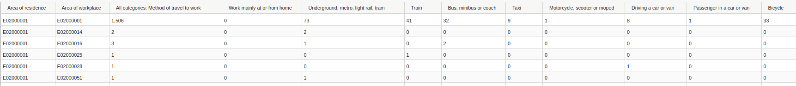

- `wu03ew_v2`: 2011, Location of usual residence and Place of work by Method of travel to work
  - Old, pre-pandemic
  - Only home -> work

## Input data: MSOA zones

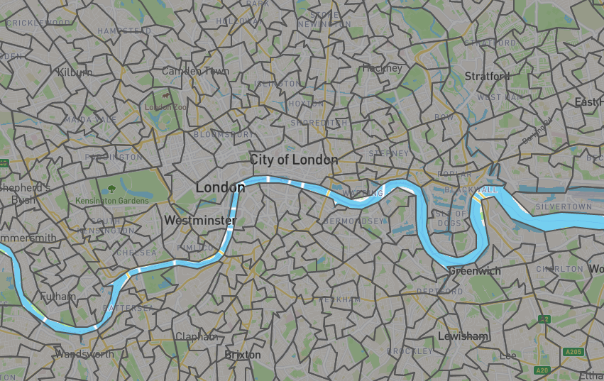

## Desire line

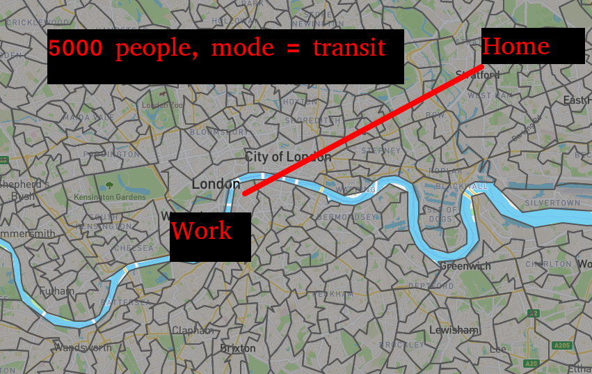

## Overall idea

:::: {.columns}
::: {.column width="50%"}
Home
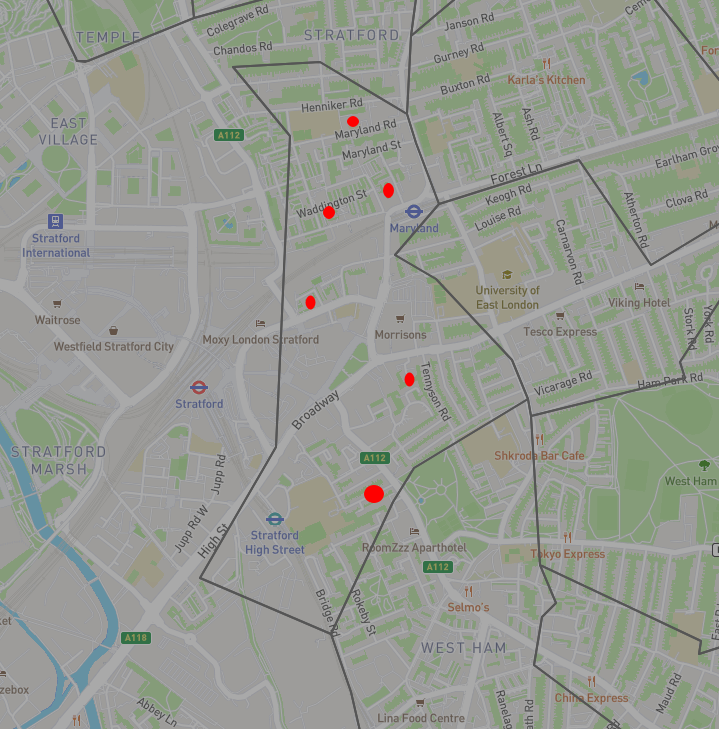
:::
::: {.column width="50%"}
Work
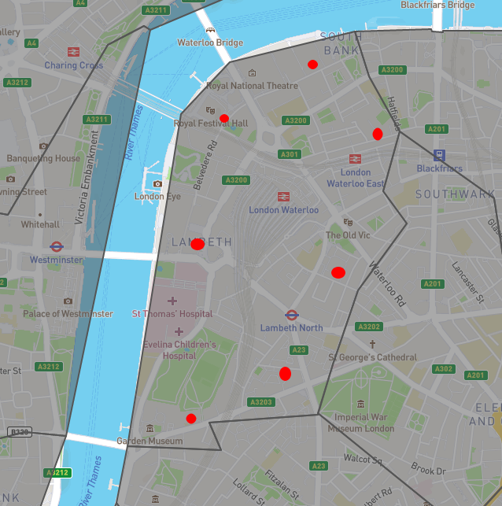
:::
::::

## Overall idea

- For each (origin, destination, mode) desire line
  - Repeat for the number of trips here
    - Sample an origin and destination from the MSOA
    - Create a person who goes home -> work in AM, work -> home in PM

## Desire lines

```
{
  from_zone: zone123,
  to_zone: zone456,
  mode: walk, bike, drive...,
  number_trips: 500
}
```

- Re-shape the input into this format
  - One mode per entry
  - Filter + simplify the modes
- Why have an intermediate common format?

## Jittering: sampling an origin or destination

:::: {.columns}
::: {.column width="50%"}
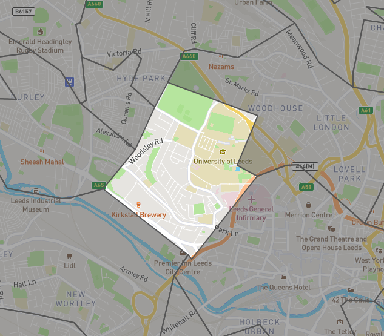
:::
::: {.column width="50%"}
::: {.incremental}
- Just inside the study area
- [odjitter](https://github.com/dabreegster/odjitter)
- Random points?
  - Origins: buildings where people live
  - Destinations: buildings where people work
:::
:::
::::

## Buildings from OpenStreetMap tags

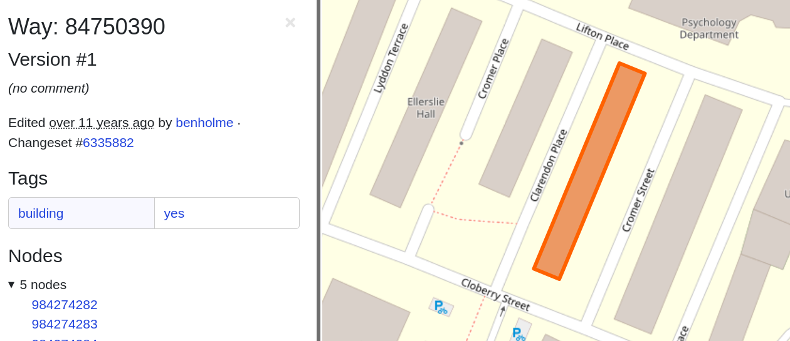

- Building type is rarely tagged
- <https://taginfo.openstreetmap.org/keys/building>

## Buildings from OpenStreetMap tags

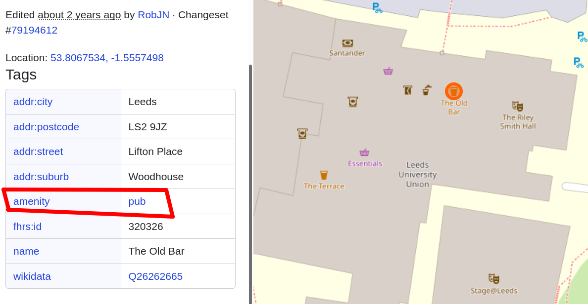

- Make sure your library gives you the right data, `building=shop`
- Just look at the data in OSM

## Weighted choices (for origins)

- single-family home vs tower block
  - area of the polygon
  - `building:levels`
- [Colouring London](https://colouringlondon.org)
- [Seattle housing units](https://data-seattlecitygis.opendata.arcgis.com/datasets/parcels-1/explore)
- Use zoning codes?
- [OpenAddresses](https://openaddresses.io) -- one housing unit per address?

## Trip attractor tables (for destinations)

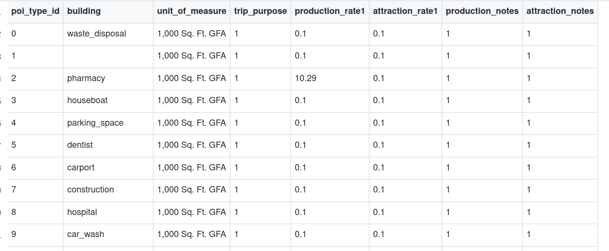

- cafe vs shopping mall
- [Trip attractor table](https://github.com/asu-trans-ai-lab/grid2demand/blob/main/examples/poi_trip_rate.csv)
  - ITE publishes one

## What data could help us pick better?

- Desire line breakdown by Standard Industry Codes?
- [NOMIS UKBC](https://cran.r-project.org/web/packages/nomisr/index.html)

## Aside: missing buildings in OSM

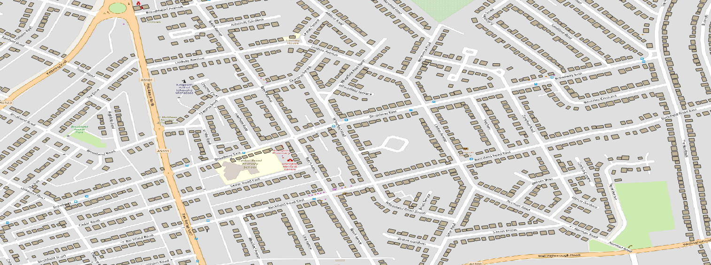

- <https://www.openstreetmap.org/#map=14/51.5318/0.1192>
- OSM isn't perfect, check your data
- Procedural generation
  - limitations
- Alternate data: OS building footprints (ZoomStack), [OpenAddresses](https://openaddresses.io)

## Study area size

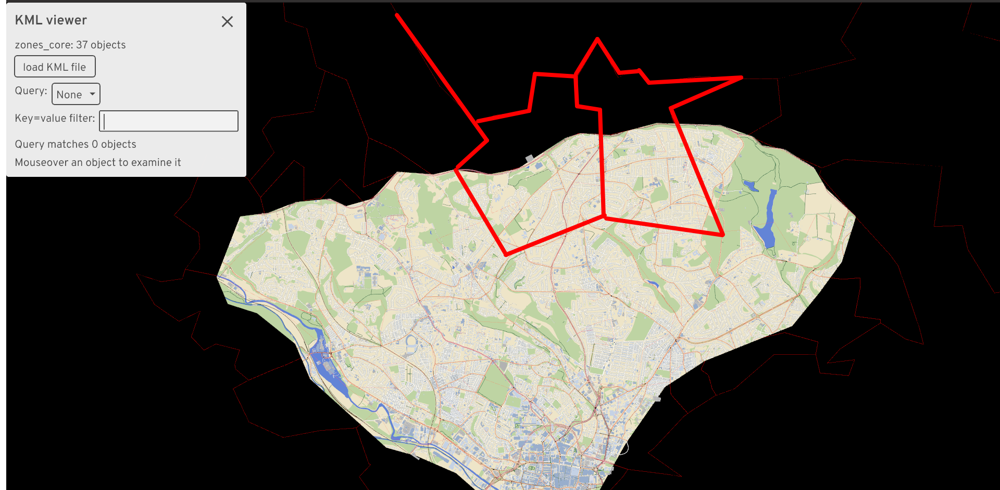

::: {.incremental}
- We can't just keep expanding our study area forever
- Some trips will begin or end off-map
- Use % overlap to scale number of trips
:::

## Jittering when out-of-bounds

:::: {.columns}
::: {.column width="50%"}
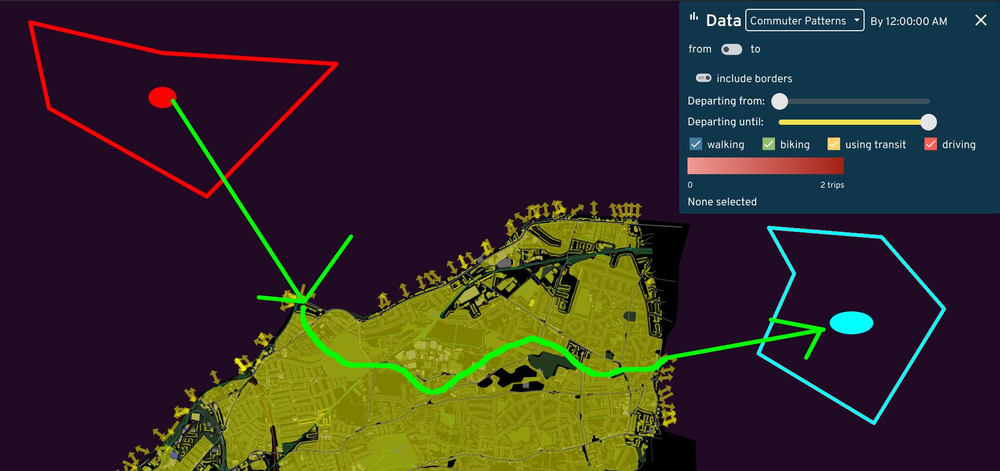
:::
::: {.column width="50%"}
- We don't know off-map buildings
- Snap to a border
  - Nearest Euclidean distance?
  - Weight by road type?
:::
::::

## Jittering when out-of-bounds

:::: {.columns}
::: {.column width="50%"}

:::
::: {.column width="50%"}
- Quickly pruning desire lines
- **Or just do pathfinding on a larger map?**
:::
::::

## Popping the stack


## Popping the stack

:::: {.columns}
::: {.column width="50%"}
Home

:::
::: {.column width="50%"}
Work

:::
::::

## Popping the stack

- Issues we covered
  - OSM building tagging
  - Missing OSM buildings
  - Partly out-of-bounds zones
  - Off-map origins/destinations

## Enjoying the results

- Let's simulate the results!

<!-- ./target/release/game --dev data/system/gb/leeds/maps/central.bin -->

## Dangers of using a microsimulation

- Routing
- Traffic signal timing
- Parking
- Conflicting movements near complex junctions

## Re-aggregating

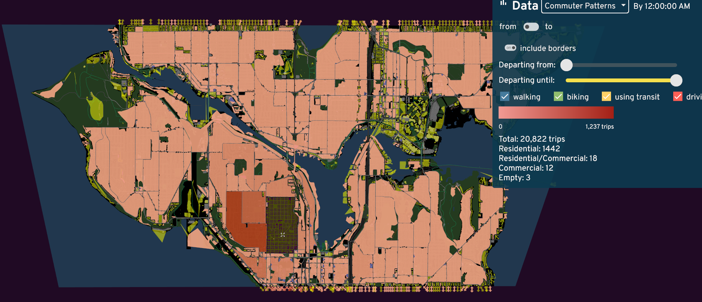

# Part 4: Activity models

- Limitations of the previous approach:
  - You need data
  - Only home to work
- What are activity models?

## The pipeline

- Input
  - Number of people living in a zone
  - OpenStreetMap
- Per-person
  - Assign a building as a home
  - Assign an "archetype" -- student, worker, care-taker
  - Assign a schedule
  - Pick buildings matching each activity
  - Assign mode

## Archetypes

- Student, worker, care-taker
  - Other ideas?
- What data would help us assign these?
  - Age, employment

## Archetype to schedule

- A student...
  - leaves home between 8-11
  - 95% of the time, spends 30 minutes on breakfast
  - goes to school for 3-6 hours
  - 30% of the time, spends 20-30 minutes on lunch
  - 60% of the time, spends 2 hours on "entertainment" -- otherwise, 0.5-1.5 hours on errands
  - returns home

## Data-driven schedules?

- time use surveys

## Where do activities occur?

- breakfast: `cafe`
- lunch: `pub`, `food_court`, `fast_food`
- dinner: `restaurant`, `theatre`, `biergarten`
- school: `college`, `kindergarten`, `language_school`, `library`, `music_school`, `university`,
- entertainment, errands, financial, healthcare, home, work
- <https://github.com/a-b-street/abstreet/blob/b969dbffe1bbb7a741b689be7e8f87b1d55a82f1/popdat/src/make_person.rs#L64>

## Gravity model + mode choice

- Attraction based on venue type
  - Advanced: based on income, prefer fancy vs cheap restaurant
- Repulsion based on cost of getting there
- Mode choice weighted by costs
  - but if know vehicle ownership, age of people...

## Activity models for real

- [Soundcast](https://www.psrc.org/activity-based-travel-model-soundcast)
  - Plenty of reading material here!
  - [Activity model primer by TRB](https://www.psrc.org/sites/default/files/shrp2_c46.pdf)
  - [Mode choice](https://www.psrc.org/sites/default/files/2015psrc-modechoiceautomodels.pdf)
- [NorMITs](https://github.com/Transport-for-the-North/NorMITs-Demand/)

## Even Soundcast isn't meant for this level of disaggregation

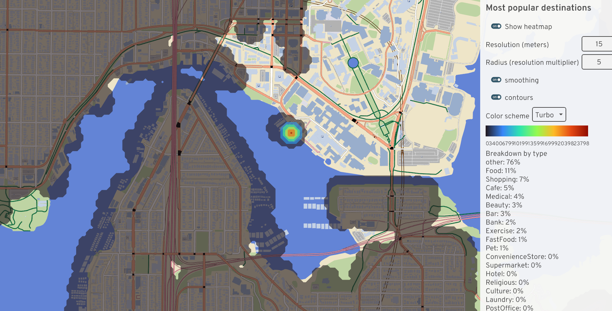

# Part 5: Mode shift

- The most important question: how do planners convince people to change travel behavior?
  - Public transit: frequency, reliability, safety, price, coverage?
  - Cycling: safety, secure parking, showering at work, subsidizing e-bikes, culture?

## An application of travel demand models

- A small piece of the puzzle: [PCT](https://itsleeds.github.io/pct/) and [Ungap the Map](http://bike.abstreet.org)
  - Where should cycling interventions be prioritized?
- [Pipeline](https://a-b-street.github.io/docs/software/ungap_the_map/tech_details.html#predict-impact)
  - Find (origin, destination) of driving trips
  - Filter by max time spent cycling and uphill distance
  - Convert to a route network, look for **popular** segments without **cycle infrastructure**

## Questions

- How do we calculate the cycling routes? (fastest vs quietest)
- How much of a route has to be safe for someone to consider mode shift?

# Part 6: Exercises / discussion

- Install A/B Street
- Import a new place
- Procedurally generate buildings
- Run a traffic simulation, observe problems
- Try out LTN, 15-minute, other tools
- Let's edit OSM!

## Discussions

- Region-specific data sources for improving what we talked about today
- How to calibrate a travel demand model?
  - What data tells us when we're realistic?
  - What parameters change?
- Do we need to start from scratch to make a model for new regions?

## Notes

```shell
./cli generate-houses \
  --map data/system/us/seattle/maps/montlake.bin \
  --num-required 1 \
  --output houses.json
```
